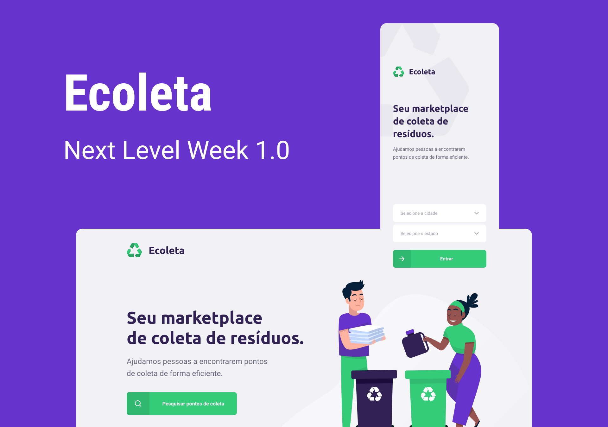
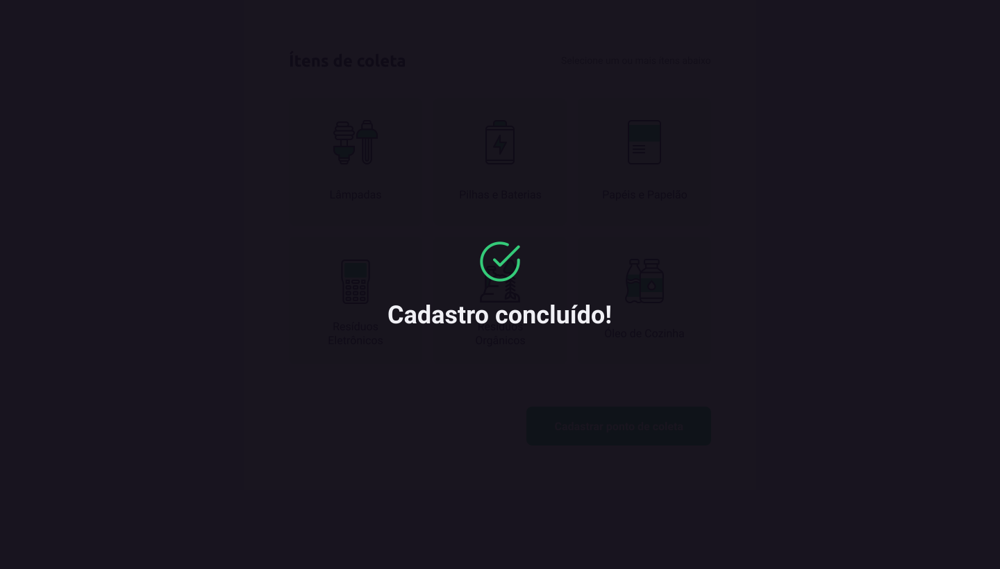

# Ecoleta

Ecoleta é um sistema desenvolvido no NLW da Rocketseat. O sistema foi feito em Nodejs, ReactJS e React Native.

## Server

Desenvolvido em NodeJS contém as regras de negócios possui as seguintes rotas:

**POST/points** - Cria pontos de coleta  
**GET/items** - Obtém lista de itens  
**GET/point** - Obtém lista de pontos de coleta  
**GET/points/:id** - Obtém um ponto de coleta em específico  

## Web

Desenvolvido em ReactJS, criado um formulário para cadastro dos pontos de coleta.

Recursos:
- API interna
- API do IBGE(Para obter cidade e estados)
- Mapa

Prints:  

Home: 

Cadastro: 

Sucesso: 

## Mobile

Desenvolvido em React Native, criado exclusivamente para consulta dos pontos de coleta.

Recursos:
- API interna
- API do IBGE(Para obter cidade e estados)
- Mapa
- Redirecionamento para outros aplicativos(Whatsapp/Email)

Prints:  
Início:  

Home: 

Detalhes: 
